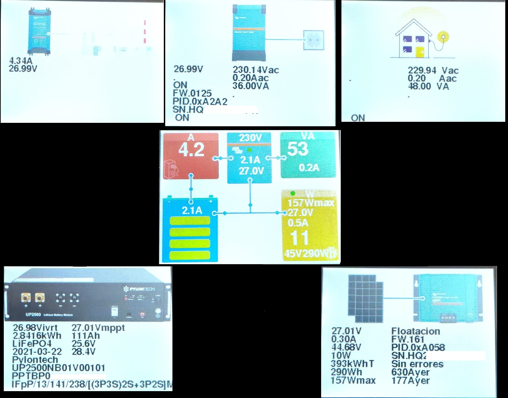
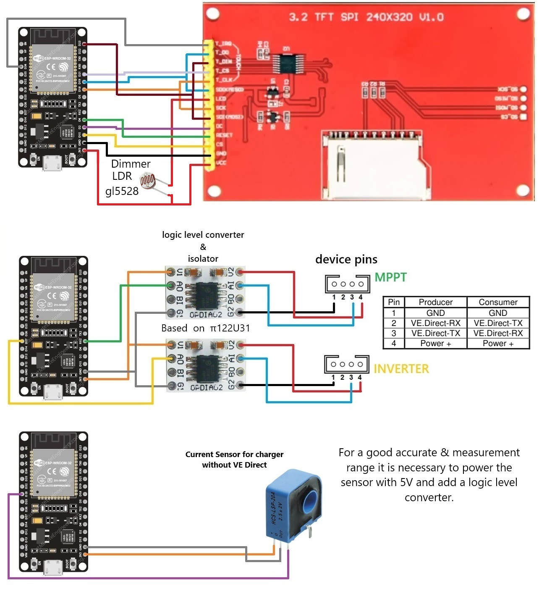

# Solar-Monitor
Monitoring the energy system through readings from the VE.Direct ports present on Vitron Energy MPPT and Inverter devices. To monitor the charger without VE.Direct a current sensor is used. A night mode was added to avoid screen glare, that does not require code, it is only necessary to add an LDR in series on the LED pin.

An ESP32 is attached, with an ili9341 screen using the touch to navigate the interface. To read the VE.Direct ports you need an isoltar and logic level converter. The ZY264-20A HCS LSP 20A current sensor can be calibrated from the code.

This is only a solar energy control monitor, it does not allow you to change the settings of your Victron devices.

First stable v1. Still some bug in the show display.
The comments are now mostly in English and some have yet to change.

Connection diagram attached

