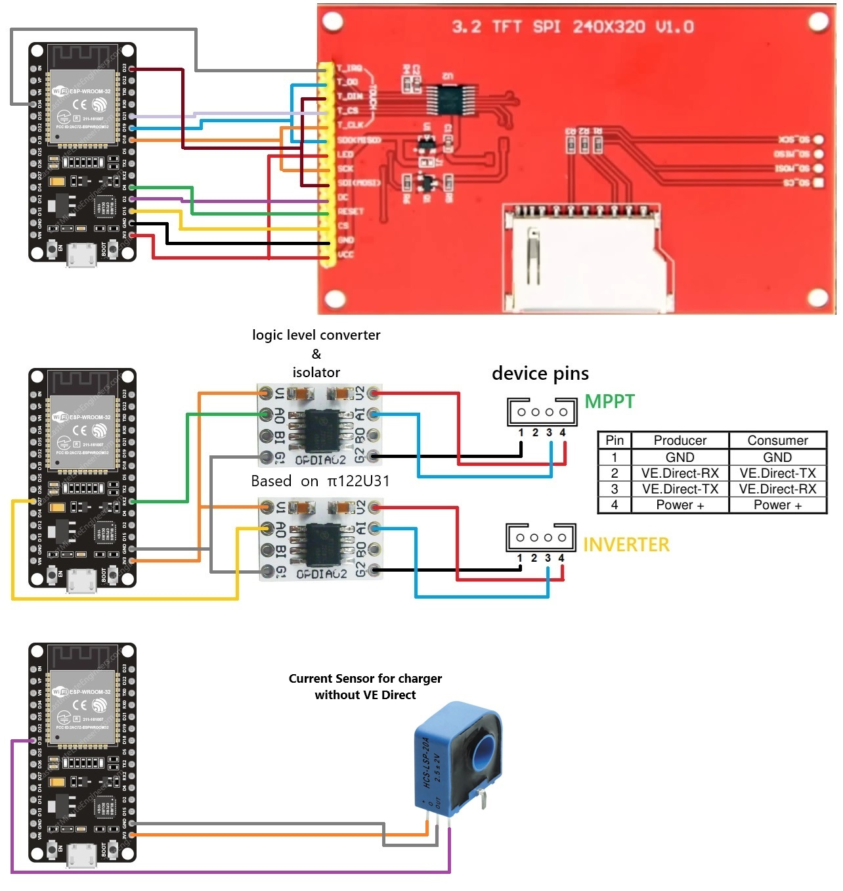

# Solar-Monitor
Monitoring of the solar energy system is facilitated directly through the readings from the VE.Direct port present on the Vitron Energy MPPT and Inverter devices. An ESP32 screen, an ILI9341 display with the touch function used to navigate through various menus and a current sensor are used to control the charger without a VE.Direct port.

They are only reading the data, no configurations are sent or the settings of the Victron Energy devices are modified.
There is still a bug and problem updating the image on the screen.

Connection diagram attached

