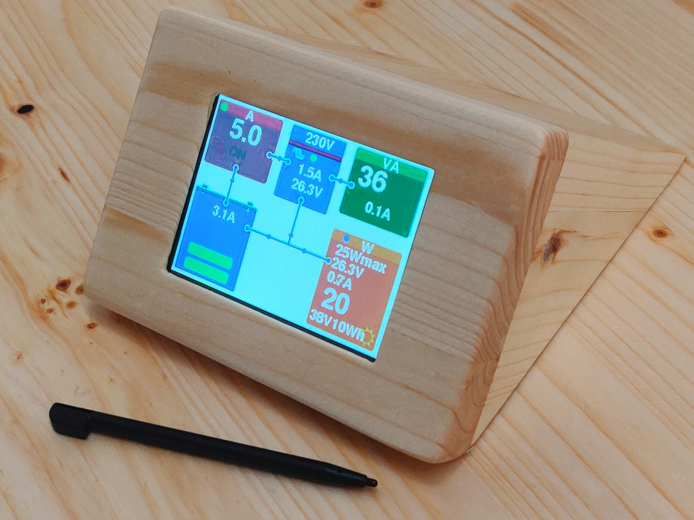
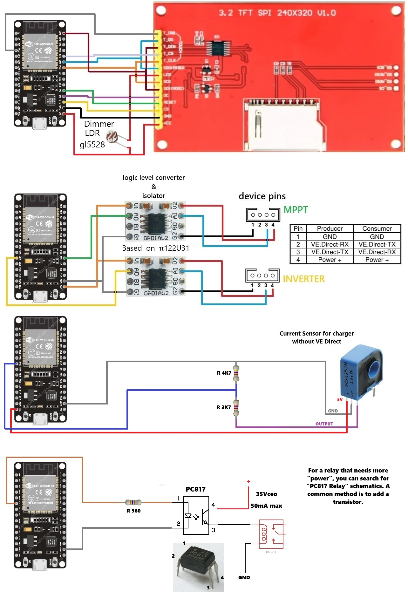

# Solar-Monitor
This text describes energy system monitoring by reading the VE.Direct ports on Victron Energy MPPT and Inverter devices. To control the charger that does not have VE.Direct, a current sensor is used.

A night mode has been incorporated to minimize screen backlighting. This mode does not require additional programming, it is only necessary to add an LDR in series on the LED pin. A pin has been assigned to automatically activate a relay in case of low battery or high power demand, and can also be activated manually from the touch screen.

The system includes an ESP32, along with an ili9341 display that uses touch functionality for interface navigation. Reading the VE.Direct ports requires an isolator and a logic level converter. The ZY264-20A HCS LSP 20A current sensor can be calibrated through the code. It is recommended to power it with 5V and add a voltage divider to adapt it to 3.3V.

It is important to note that this system is only a solar energy control monitor and does not allow modifying the configuration of Victron devices.

Connection diagram attached

