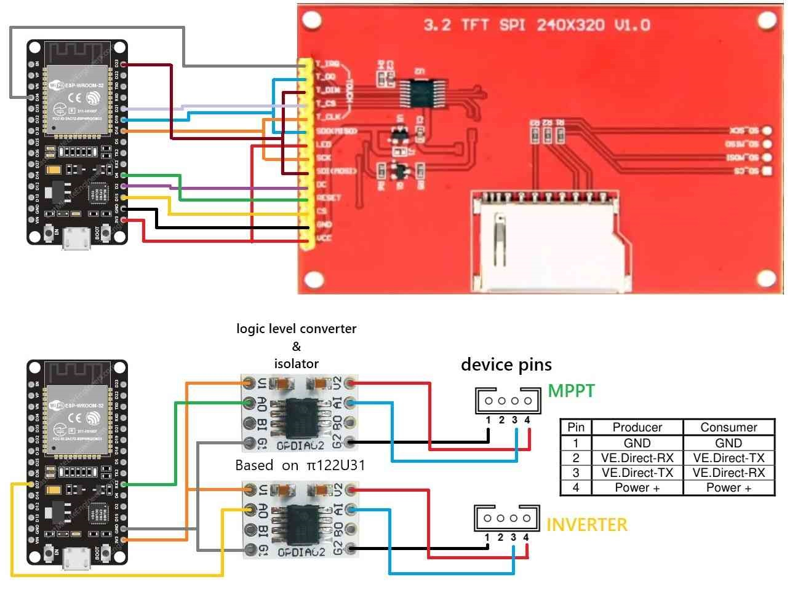

# Solar-Monitor
Monitoring the solar energy system is directly facilitated through port readings VE.Direct present in Vitron Energy devices. An ESP32 and an ILI9341 screen are utilized, with the touch function employed to navigate various menus.

Attached diagram of connections

